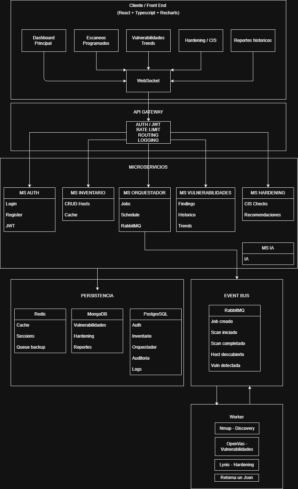

# PROYECTO: Sistema de Escaneo de Vulnerabilidades Distribuido
## Arquitectura Completa - Fullstack 3 Duoc
 
---

## 📐 1. DIAGRAMA DE ARQUITECTURA GENERAL

```


```
 
---

## 📊 2. FLUJO DE OPERACIÓN PRINCIPAL

### Scenario: Usuario programa un escaneo

```


```